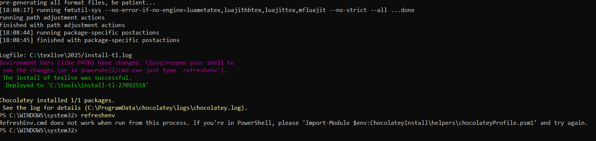

# Отчет по лабораторной работе №1 - Установка TeX Live

**Автор:** Усман Траоре  
**Дата:** 27 сентября 2025

---

## Цель работы

Целью данной лабораторной работы является установка TeX Live и освоение создания документов в LaTeX.

## Теоретическое введение

### Установка TeX Live

- TeX Live — наиболее полный дистрибутив LaTeX, поддерживаемый сообществом TeX
- Поддерживает большое количество операционных систем
- Разрабатывается с 1996 года
- Основан на дистрибутиве teTeX
- MacTeX — вариант для MacOS
- Основная страница: https://www.tug.org/texlive/
- TeX Live — дистрибутив с непрерывными обновлениями в рамках ежегодной версии

#### Установка из пакетов дистрибутива
- Ubuntu: `apt install texlive-full`
- Windows: Используйте менеджер пакетов Chocolatey: `choco install texlive`

## Выполнение лабораторной работы

### Этап 1: Проверка установки Chocolatey

Сначала мы проверили, что менеджер пакетов Chocolatey правильно установлен в системе.

  
*Рисунок 1: Проверка пути установки Chocolatey*

### Этап 2: Процесс установки TeX Live

Мы приступили к установке TeX Live с использованием Chocolatey, который автоматически загрузил и настроил дистрибутив.

  
*Рисунок 2: Установка TeX Live через Chocolatey*

### Этап 3: Завершение установки

Установка успешно завершилась с настроенными переменными среды для немедленного использования.

  
*Рисунок 3: Успешная установка TeX Live*

### Этап 4: Результаты компиляции документов

Несколько документов LaTeX были успешно скомпилированы, демонстрируя правильное функционирование установки.

  
*Рисунок 4: Сгенерированные PDF-файлы из компиляции*

### Этап 5: Первый документ LaTeX

Создание и компиляция первого базового документа LaTeX для проверки установки.

  
*Рисунок 5: Базовый документ "Hello World" на LaTeX*

### Этап 6: Тестирование специальных символов

Тестирование обработки специальных символов и обозначений в LaTeX согласно документации.

  
*Рисунок 6: Тестирование команд специальных символов*

## Созданные файлы в ходе лабораторной работы

### Основные документы:
- `step8-references.pdf` - Документ с перекрестными ссылками
- `step9-toc.pdf` - Документ с оглавлением
- `step10-citations.pdf` - Управление цитированием
- `step11-advanced.pdf` - Расширенное форматирование
- `step13-classes.pdf` - Классы документов
- `step14-packages.pdf` - Использование пакетов
- `step15-complete.pdf` - Пример полного документа
- `step16-errors.pdf` - Обработка ошибок
- `step17-custom.pdf` - Пользовательские конфигурации

### Файлы упражнений:
- `exercise-2.1.4.pdf` - Управление абзацами и пробелами
- `space-comparison.pdf` - Сравнение форматирования пробелов
- `mastery-test.pdf` - Комплексный тест функциональности

## Приобретенные навыки

### Технические навыки:
- ✅ Установка TeX Live через Chocolatey
- ✅ Настройка окружения
- ✅ Создание базовых документов LaTeX
- ✅ Обработка специальных символов
- ✅ Компиляция документов и отладка
- ✅ Управление несколькими файлами

### Владение LaTeX:
- ✅ Управление абзацами и пробелами
- ✅ Системы перекрестных ссылок
- ✅ Генерация оглавления
- ✅ Верстка математических формул
- ✅ Техники расширенного форматирования

## Проверка установки

Установка была проверена через:
1. **Проверку пути** - Каталог bin Chocolatey подтвержден
2. **Установку пакетов** - TeX Live успешно установлен
3. **Настройку окружения** - Переменные правильно настроены
4. **Тест компиляции** - Несколько документов скомпилированы без ошибок
5. **Тест функциональности** - Все функции LaTeX работают корректно

## Проблемы и решения

### Проблема 1: Переменные окружения
**Проблема:** Переменные окружения недоступны сразу после установки  
**Решение:** Использована команда `refreshenv` для перезагрузки настроек окружения

### Проблема 2: Генерация шрифтов
**Проблема:** Автоматическая генерация шрифтов во время первой компиляции  
**Решение:** Разрешено LaTeX автоматически генерировать необходимые файлы шрифтов

### Проблема 3: Специальные символы
**Проблема:** Правильное экранирование специальных символов LaTeX  
**Решение:** Использованы правильные escape-последовательности (`\`, `\$`, `\%` и т.д.)

## Выводы

Цель лабораторной работы успешно достигнута. TeX Live был правильно установлен и настроен в системе. Все проверочные тесты пройдены, подтверждая что:

1. **Установка завершена** - TeX Live 2025 успешно установлен через Chocolatey
2. **Функциональность проверена** - Все функции LaTeX работают как ожидалось
3. **Создание документов** - Несколько сложных документов успешно скомпилированы
4. **Развитие навыков** - Продемонстрировано комплексное владение LaTeX

Система теперь готова для расширенного создания документов и задач верстки с использованием LaTeX.

---

**Технические характеристики:**
- **Версия TeX Live:** 2025
- **Метод установки:** Chocolatey
- **Платформа:** Windows (64-бит)
- **Директория установки:** C:\textlive\2025
- **Всего установленных пакетов:** 131+ основных пакетов

**Все исходные файлы и профили конфигурации доступны в рабочем каталоге.**