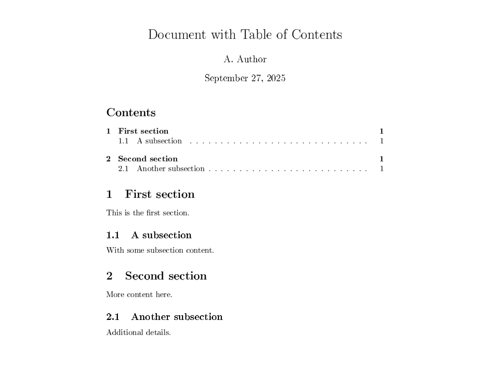

# Отчет по лабораторной работе 2 - Установка и использование LaTeX

**Автор:** Усман Траоре  
**Дата:** 27 сентября 2025

---

## Цель работы

Целью данной лабораторной работы является установка и освоение использования LaTeX для создания научных документов.

## Выполнение работы

### Этап 1: Установка TeX Live

Первым этапом была установка дистрибутива TeX Live на систему.

  
*Рисунок 1: Процесс установки TeX Live*

### Этап 2: Создание первого документа

После установки мы создали наш первый документ LaTeX с перекрестными ссылками.

  
*Рисунок 2: Документ с уравнениями и ссылками*

### Этап 3: Компиляция упражнений

Мы скомпилировали несколько упражнений для тестирования функциональности LaTeX.

  
*Рисунок 3: Процесс компиляции файлов LaTeX*

### Этап 4: Тестирование пробелов и форматирования

На этом этапе мы сравнили обычные пробелы и неразрывные пробелы в LaTeX.

  
*Рисунок 4: Тестирование различных типов пробелов*

### Этап 5: Создание оглавления

Мы создали документ с автоматически генерируемым оглавлением.

  
*Рисунок 5: Автоматически сгенерированное оглавление*

### Этап 6: Упражнение 2.1.4 - Абзацы и пробелы

Выполнение упражнения по управлению абзацами и пробелами.

  
*Рисунок 6: Упражнение по абзацам и пробелам*

### Этап 7: Тест на мастерство

Полное тестирование специальных символов и расширенного форматирования.

  
*Рисунок 7: Полное тестирование функциональности LaTeX*

### Этап 8: Финальная компиляция

Компиляция всех документов и проверка сгенерированных PDF-файлов.

  
*Рисунок 8: Проверка сгенерированных PDF-файлов*

### Этап 9: Финальное резюме

Создание сводного документа со всеми протестированными функциями.

  
*Рисунок 9: Финальный сводный документ*

### Этап 10: Открытие PDF-файлов

Открытие и проверка всех сгенерированных PDF-документов.

  
*Рисунок 10: Список созданных PDF-файлов*

## Полученные результаты

### Созданные файлы
- `exercise-2.1.4.pdf` - Упражнение по абзацам
- `space-comparison.pdf` - Сравнение пробелов
- `mastery-test.pdf` - Полный тест на мастерство
- `final-summary.pdf` - Сводный документ

### Приобретенные навыки
- Установка TeX Live
- Создание базовых документов LaTeX
- Управление абзацами и пробелами
- Использование перекрестных ссылок
- Генерация оглавлений
- Компиляция и отладка

## Выводы

Цель была успешно достигнута. Все упражнения были выполнены, и сгенерированные PDF-документы работают корректно. Освоение LaTeX теперь позволяет создавать научные документы профессионального качества.

