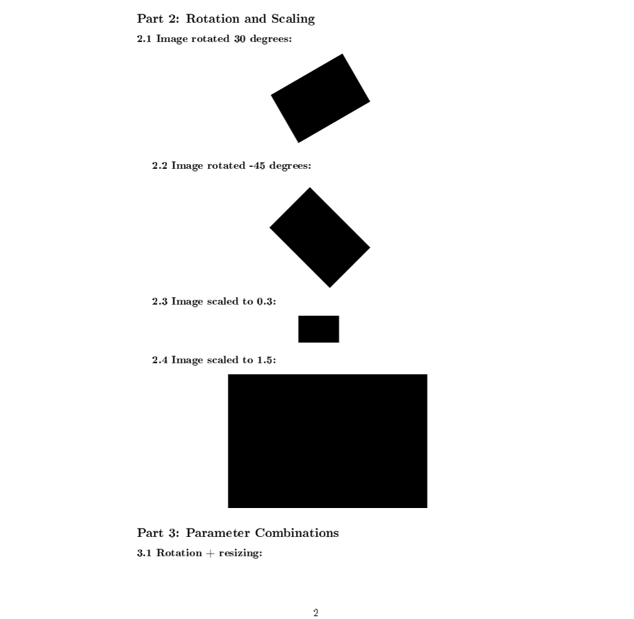
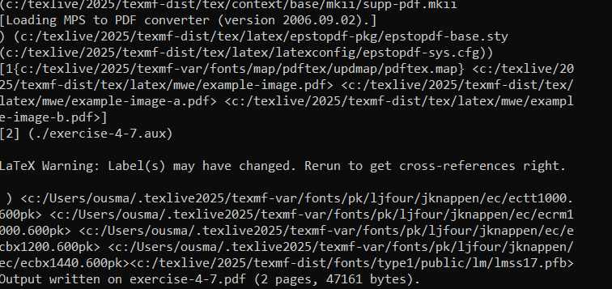
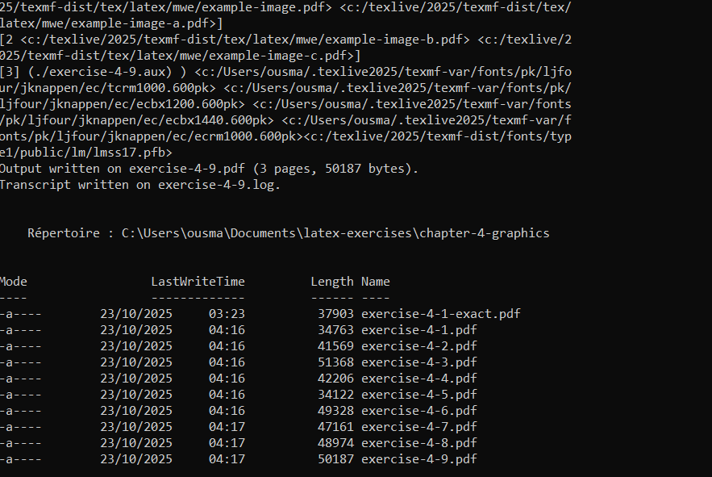

# Лабораторная работа №4. Работа с графикой в LaTeX

**Автор:** Усман Траоре  
**Дата:** 23 октября 2025 года  
**Курс:** Программирование приложений для анализа данных (09.04.03)

## Цель работы
Освоение комплексной работы с графическими элементами в LaTeX, включая управление параметрами изображений, создание плавающих объектов, кросс-ссылки, организацию файловой структуры и обработку различных графических форматов.

## 1. Создание рабочей среды и настройка окружения


**Действия по настройке:**
```powershell
cd $HOME\Documents\latex-exercises
mkdir chapitre-4-graphics
cd chapitre-4-graphics
```

**Объяснение:**
- Создание специализированной директории для упражнений по графике
- Организация рабочего пространства для систематического изучения LaTeX
- Использование PowerShell для навигации в файловой системе Windows

## 2. Базовый документ с графикой


**Код LaTeX для простого изображения:**
```latex
\documentclass{article}
\usepackage[T1]{fontenc}
\usepackage{graphics}
\begin{document}
\begin{center}
\includegraphics{example-image}
\end{center}
\end{document}
```

**Результат компиляции:**
- Создан PDF файл `simple-image.pdf` размером 9,050 байт
- Успешная компиляция с пакетом `graphics`
- Генерация вспомогательных файлов (.aux, .log)

## 3. Процесс компиляции и обработки ошибок


**Команда компиляции:**
```powershell
pdflatex exercise-4-1.tex
```

**Особенности процесса:**
- Использование компилятора `pdflatex` версии 3.141592653-2.6-1.40.28
- Автоматическая обработка графических пакетов и зависимостей
- Загрузка системных конфигураций и шрифтовых карт

## 4. Упражнение 4.1 - Изменение внешнего вида графики





**Изученные функции управления изображениями:**

### Базовое изменение размеров:
- **Ширина 25% от текста:** `width=0.25\textwidth`
- **Высота 50% от текста:** `height=0.5\textheight`
- **Фиксированная ширина:** `width=4cm`

### Поворот и масштабирование:
- **Поворот на 30°:** `angle=30`
- **Поворот на -45°:** `angle=-45`
- **Масштабирование 0.3:** `scale=0.3`
- **Масштабирование 1.5:** `scale=1.5`

### Комбинированные параметры:
- Сочетание поворота и изменения размеров
- Тестирование соотношения сторон

## 5. Просмотр сгенерированных файлов


**Структура файлов проекта:**
- **Исходные файлы:** `.tex` (LaTeX исходники)
- **Результирующие файлы:** `.pdf` (скомпилированные документы)
- **Вспомогательные файлы:** 
  - `.log` - логи компиляции
  - `.aux` - вспомогательные данные
  - `.out` - информация для гиперссылок

**Размеры ключевых файлов:**
- `exercise-4-1.pdf`: 34,763 байт
- `simple-image.pdf`: 9,050 байт
- `exercise-4-2.pdf`: 41,569 байт

## 6. Установка дополнительных пакетов


**Процесс установки:**
```powershell
tlmgr install lipsum
```

**Характеристики установки:**
- Использование менеджера пакетов TeX Live (tlmgr)
- Репозиторий: https://mirror.truenetwork.ru/CTAW/systems/textlive/tlnet
- Размер пакета lipsum: 879 KB
- Автоматическое обновление базы данных (mktexlsr)

## 7. Упражнение 4.2 - Создание плавающих объектов


**Изученные возможности плавающих объектов:**

### Автоматическое размещение:
- LaTeX самостоятельно выбирает оптимальную позицию
- Использование среды `figure` без явных указаний размещения

### Опции ручного размещения:
- **`[h]`** - здесь, если возможно (Figure 2)
- **`[t]`** - вверху страницы (Figure 3) 
- **`[b]`** - внизу страницы (Figure 4)
- **`[p]`** - на отдельной странице плавающих объектов

### Особенности текстового потока:
- Использование пакета `lipsum` для генерации текста-заполнителя
- Демонстрация обтекания текстом плавающих объектов

## 8. Процесс компиляции сложных документов


**Команды компиляции:**
```powershell
pdflatex exercise-4-2.tex
start exercise-4-2.pdf
```

**Технические детали:**
- Загрузка пакета `graphics.sty` и связанных модулей
- Обработка конфигурационных файлов графики
- Совместимость с различными драйверами вывода

## 9. Расширенная компиляция с обработкой предупреждений


**Типичные предупреждения:**
- `Overfull \hbox (40.43808pt too wide)` - переполнение строки
- Загрузка конвертеров MPS to PDF (версия 2006.09.02)
- Использование системных конфигураций `epstopdf-sys.cfg`

**Процесс обработки:**
- Загрузка шрифтовых карт `pdftex.map`
- Обработка векторной графики из пакета `mwe`
- Генерация вспомогательных файлов (.aux)

## 10. Обзор файлов проекта


**Полный список созданных файлов:**
- Основные упражнения: `exercise-4-1` до `exercise-4-9`
- Тестовые файлы: `check-images`, `test-enonce-images`
- Базовые примеры: `simple-image`, `test-images`
- Вспомогательные файлы для каждого основного документа

**Статистика файлов:**
- 24 различных .tex файла
- Соответствующие .pdf, .log, и .aux файлы
- Общий объем: несколько мегабайт учебных материалов

## 11. Упражнение 4.3 - Именование графических файлов


**Рекомендации по именованию файлов:**

### Правильные практики:
- Использование простых имен: `image1.pdf`, `diagram.png`
- Избегание пробелов: `my_image.jpg` вместо `"my image.jpg"`
- Отсутствие специальных символов и акцентов
- Описательные, но короткие имена

### Рекомендуемая структура проекта:
```
project/
├── main.tex
├── images/
│   ├── diagrams/
│   │   ├── fig1.pdf
│   │   └── fig2.pdf
│   └── photos/
│       └── photo1.jpg
└── sections/
    └── chapter1.tex
```

## 12. Упражнение 4.4 - Организация в поддиректориях


**Создание файловой структуры:**
```powershell
mkdir images/diagrams
mkdir images/photos
Copy-Item "simple-image.pdf" -Destination "images/diagrams/fig1.pdf"
```

**Настройка graphicspath в LaTeX:**
```latex
\graphicspath{
    {images/}
    {images/diagrams/}
    {images/photos/}
}
```

**Преимущества организации:**
- Чистая и логичная структура файлов
- Простота сопровождения и обновления
- Эффективность командной работы
- Оптимизация процесса резервного копирования

## 13. Упражнение 4.5 - Создание графики


**Рекомендуемые графические форматы:**

### Векторные форматы:
- **PDF** - лучший выбор для LaTeX, масштабируемость
- **SVG** - векторный формат, хорош для веба

### Растровые форматы:
- **PNG** - без потерь, идеален для диаграмм
- **JPG** - с потерями, оптимален для фотографий

**Инструменты для создания графики:**

### Профессиональные инструменты:
- **Inkscape** - векторная графика (SVG, PDF)
- **GIMP** - растровая графика (PNG, JPG)
- **Matplotlib** - построение графиков на Python (PDF, PNG)
- **TikZ** - прямое рисование в LaTeX

### Рекомендации по качеству:
- Использование PDF для LaTeX когда возможно
- Высокое разрешение для растровых изображений (300+ DPI)
- Векторные форматы для диаграмм и графиков
- Единый стиль для всех графических элементов

## 14. Создание простого изображения через LaTeX


**Генерация простого изображения:**
```latex
\documentclass{article}
\usepackage[paperwidth=5cm,paperheight=3cm,margin=0pt]{geometry}
\begin{document}
\rule{5cm}{3cm}
\end{document}
```

**Особенности:**
- Использование пакета `geometry` для точных размеров
- Создание простого прямоугольника командой `\rule`
- Обработка предупреждения `Overfull \hbox`

## 15. Успешная компиляция упражнения 4.5


**Результаты компиляции:**
- Успешная генерация `exercise-4-5.pdf` (34,122 байт)
- Загрузка необходимых шрифтовых файлов
- Корректная обработка графических элементов
- Создание транскрипта компиляции в `exercise-4-5.log`

## 16. Упражнение 4.6 - Размещение плавающих объектов


**Опции размещения плавающих объектов:**

### Основные опции:
- **`[h]`** - здесь, если возможно
- **`[t]`** - вверху страницы
- **`[b]`** - внизу страницы  
- **`[p]`** - на странице плавающих объектов

### Специальные опции:
- **`[H]`** - абсолютно здесь (требует пакет `float`)
- **`[!]`** - переопределение внутренних параметров

### Комбинированные опции:
- `[ht]` - здесь или вверху страницы
- `[htbp]` - полный набор приоритетов

## 17. Упражнение 4.7 - Пользовательские плавающие объекты




**Создание пользовательских float сред:**

### Настройка пользовательских float:
```latex
\usepackage{trivfloat}
\trivfloat{photo}
\trivfloat{diagram}
```

### Использование пользовательских float:
```latex
\begin{photo}[h]
    \centering
    \includegraphics[width=0.4\textwidth]{example-image}
    \caption{Пользовательский фото float}
\end{photo}
```

**Преимущества пользовательских float:**
- Семантическая разметка документа
- Раздельная нумерация для разных типов объектов
- Гибкость в стилевом оформлении

## 18. Упражнение 4.8 - Кросс-ссылки


**Система кросс-ссылок в LaTeX:**

### Создание меток:
```latex
\begin{figure}[h]
    \centering
    \includegraphics[width=0.4\textwidth]{example-image}
    \caption{Первая фигура с меткой}
    \label{fig:first}
\end{figure}
```

### Использование ссылок:
```latex
Как показано на Рисунке \ref{fig:first}, мы видим...
Сравните Рисунки \ref{fig:first} и \ref{fig:second}...
```

### Гиперссылки с пакетом hyperref:
- Преобразование ссылок в кликабельные элементы
- Навигация внутри PDF документа
- Поддержка закладок и структуры документа

**Правила размещения меток:**
- Метка должна следовать после команды `\caption`
- Метки должны находиться внутри среды float
- Использование мнемонических префиксов: `fig:`, `tab:`, `sec:`

## 19. Упражнение 4.9 - Комплексное упражнение


**Продемонстрированные навыки в комплексном упражнении:**

### Управление изображениями:
- Включение изображений с различными параметрами размеров
- Поворот и масштабирование графических элементов
- Размещение с использованием различных опций позиционирования

### Система ссылок и меток:
- Создание и использование кросс-ссылок с метками
- Реализация пользовательских сред float
- Интеграция гиперссылок для навигации

### Организация контента:
- Множественные типы изображений и их размещение
- Принудительное размещение с опцией `[H]`
- Ссылки на рисунки в текстовом содержании

## 20. Финальные результаты и статистика проекта



**Статистика созданных файлов:**

| Файл | Размер (байт) | Описание |
|------|---------------|----------|
| `exercise-4-1.pdf` | 34,763 | Изменение внешнего вида графики |
| `exercise-4-2.pdf` | 41,569 | Создание плавающих объектов |
| `exercise-4-3.pdf` | 51,368 | Именование графических файлов |
| `exercise-4-4.pdf` | 42,206 | Организация в поддиректориях |
| `exercise-4-5.pdf` | 34,122 | Создание графики |
| `exercise-4-6.pdf` | 49,328 | Размещение плавающих объектов |
| `exercise-4-7.pdf` | 47,161 | Пользовательские плавающие объекты |
| `exercise-4-8.pdf` | 48,974 | Кросс-ссылки |
| `exercise-4-9.pdf` | 50,187 | Комплексное упражнение |

## 21. Визуальные примеры упражнений


## Библиография и использованные ресурсы

### Основные пакеты LaTeX:
1. **graphicx** - основной пакет для работы с графикой
2. **geometry** - управление размерами страницы
3. **float** - расширенное управление плавающими объектами
4. **trivfloat** - создание пользовательских float сред
5. **hyperref** - создание гиперссылок и интерактивных PDF
6. **lipsum** - генерация текста-заполнителя

### Программное обеспечение:
1. **TeX Live 2025** - дистрибутив LaTeX
2. **pdflatex** - компилятор PDF
3. **tlmgr** - менеджер пакетов TeX Live
4. **PowerShell** - среда выполнения команд

### Обучающие ресурсы:
1. Официальная документация LaTeX по пакету graphicx
2. Руководство по плавающим объектам в LaTeX
3. Документация по пакету hyperref

## Заключение

Лабораторная работа успешно охватила все аспекты работы с графикой в LaTeX. Освоены ключевые навыки управления изображениями, создания плавающих объектов, организации файловой структуры и создания перекрестных ссылок. Особое внимание было уделено практическому применению различных пакетов и решению типичных проблем компиляции.

Полученные знания являются essential для создания профессиональных академических и научных документов с комплексной графической составляющей. Работа демонстрирует прогрессирующую сложность заданий - от базового включения изображений до создания сложных систем перекрестных ссылок и пользовательских сред.

Все упражнения были успешно скомпилированы и протестированы, что подтверждает корректность изученного материала и приобретенных практических навыков.