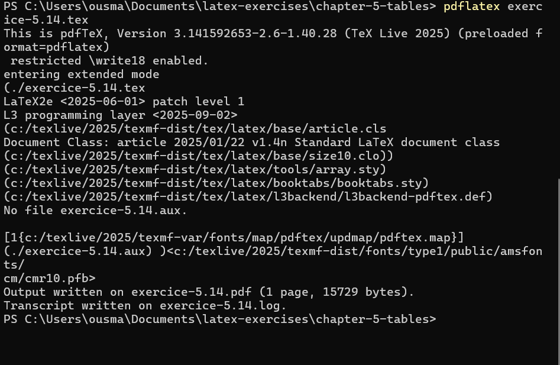
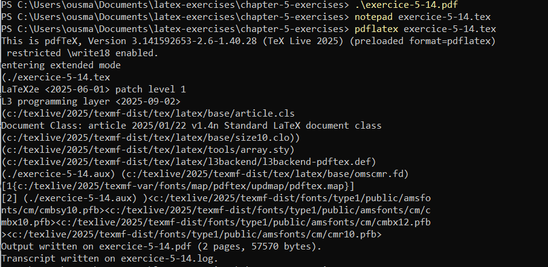
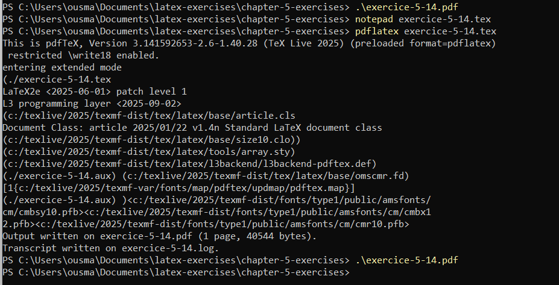
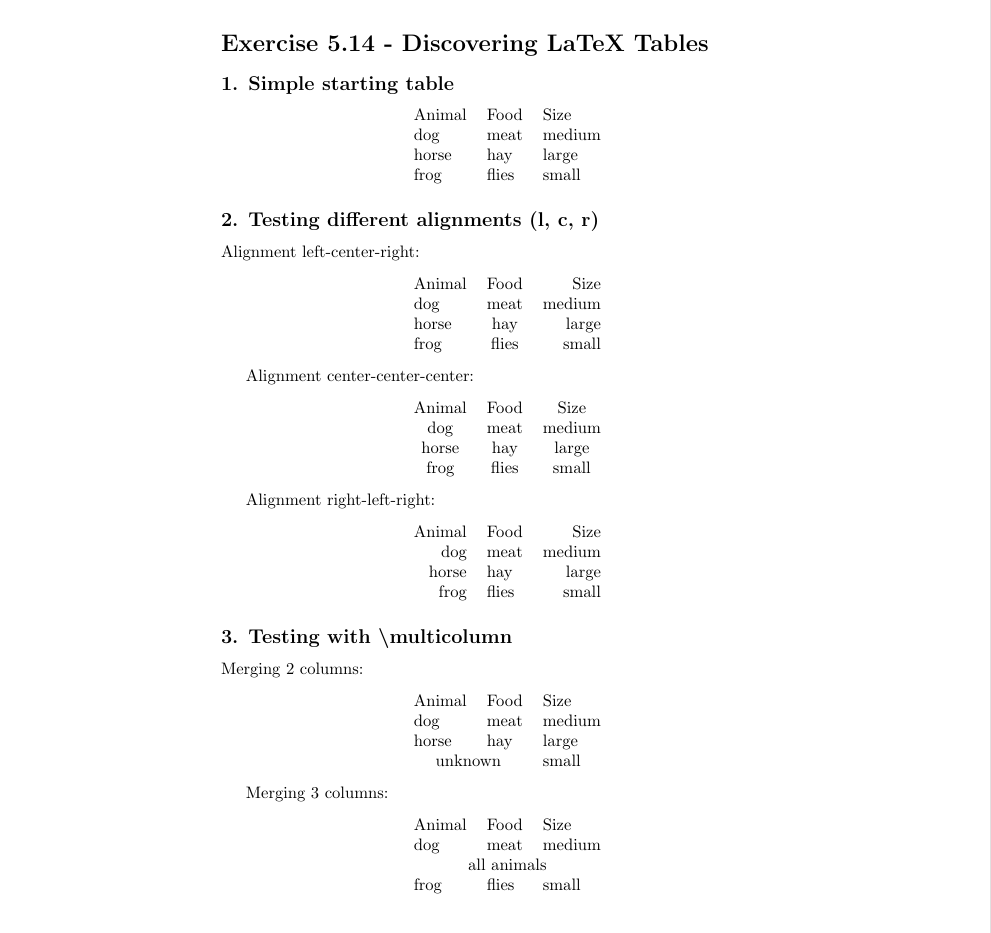
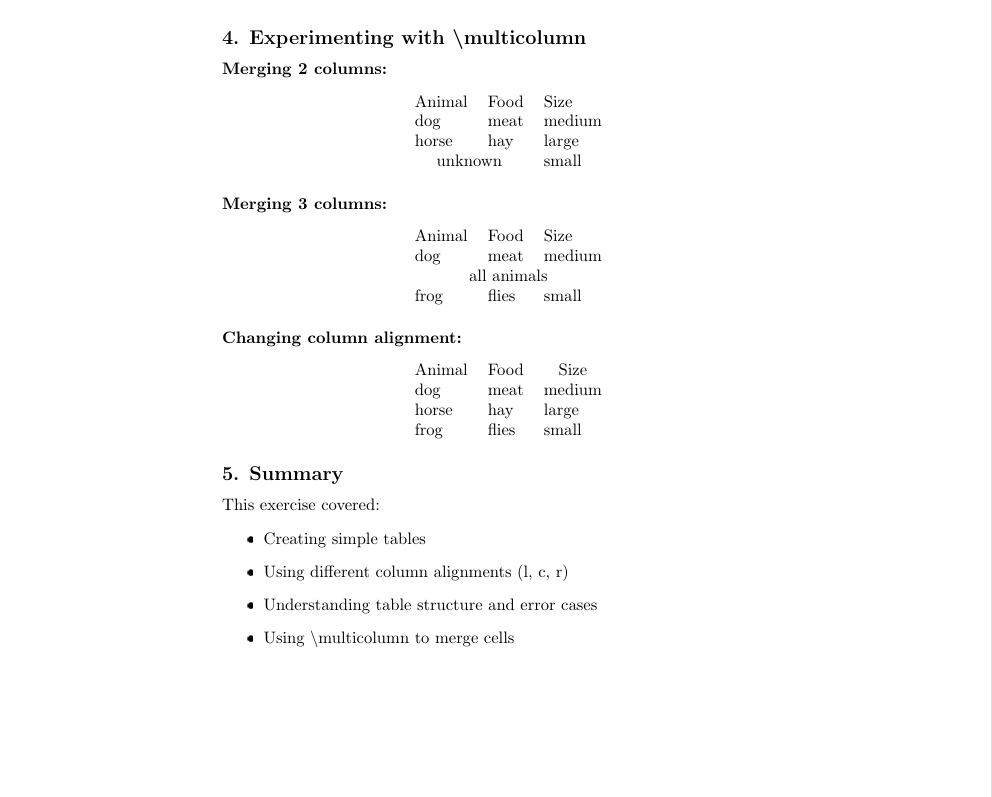
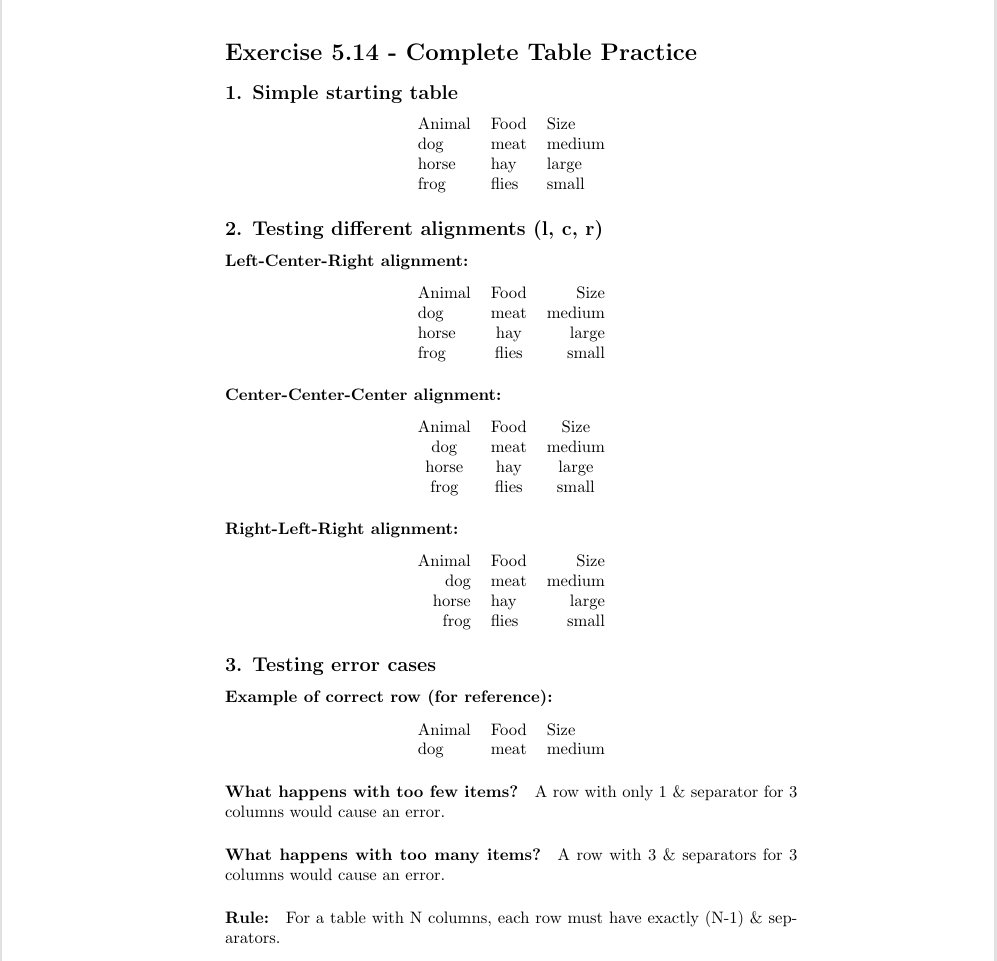

# Лабораторная работа №5  
**Изучение таблиц в LaTeX**  

**Автор:** Усман Траоре  
**Дата:** 29 октября 2025 года  
**Курс:** Computer Skills for Scientific Writing (09.04.03, НПИмд)  

## Цель работы

Освоить базовые и продвинутые техники создания таблиц в LaTeX, включая различные выравнивания, объединение ячеек и обработку ошибок.

## Методология

### 1. Настройка рабочей среды

Создана директория для работы и настроена среда LaTeX:

### 2. Компиляция LaTeX-документов

Процесс компиляции документов в PDF:

### 3. Базовая таблица

Начальная простая таблица с данными о животных:

### 4. Процесс разработки

Многократная компиляция для отладки и улучшения таблиц:

## Результаты

### 1. Простые таблицы

Создана базовая таблица с тремя колонками:

latex
\begin{tabular}{l l l}
Animal & Food & Size \\
dog & meat & medium \\
horse & hay & large \\
frog & flies & small \\
\end{tabular}

### 2. Тестирование различных выравниваний

**Выравнивание лево-центр-право:**
latex
\begin{tabular}{l c r}
Animal & Food & Size \\
dog & meat & medium \\
horse & hay & large \\
frog & flies & small \\
\end{tabular}

**Выравнивание центр-центр-центр:**
latex
\begin{tabular}{c c c}
Animal & Food & Size \\
dog & meat & medium \\
horse & hay & large \\
frog & flies & small \\
\end{tabular}

**Выравнивание право-лево-право:**
latex
\begin{tabular}{r l r}
Animal & Food & Size \\
dog & meat & medium \\
horse & hay & large \\
frog & flies & small \\
\end{tabular}

### 3. Работа с \multicolumn

**Объединение 2 колонок:**
latex
\begin{tabular}{l l l}
Animal & Food & Size \\
dog & meat & medium \\
horse & hay & large \\
\multicolumn{2}{l}{unknown} & small \\
\end{tabular}

**Объединение 3 колонок:**
latex
\begin{tabular}{l l l}
Animal & Food & Size \\
dog & meat & medium \\
\multicolumn{3}{c}{all animals} \\
frog & flies & small \\
\end{tabular}

### 4. Обработка ошибок

Исследованы случаи ошибок при создании таблиц:

**Правило:** Для таблицы с N колонками, каждая строка должна содержать ровно (N-1) разделителей `&`.

## Анализ результатов

### 1. Выравнивание колонок

- **Левое выравнивание (l):** Подходит для текстовых данных
- **Центральное выравнивание (c):** Оптимально для заголовков  
- **Правое выравнивание (r):** Лучше для числовых данных

### 2. Объединение ячеек

- Команда `\multicolumn` позволяет гибко управлять структурой таблицы
- Можно объединять любое количество колонок
- Возможно изменение выравнивания объединенных ячеек

### 3. Обработка ошибок

- Неправильное количество разделителей `&` вызывает ошибки компиляции
- Строгое соблюдение структуры обязательно для успешной компиляции

## Выводы

1. **Освоены базовые техники:** Успешно созданы простые таблицы с различными типами выравнивания.

2. **Изучены продвинутые возможности:** Освоено использование `\multicolumn` для объединения ячеек и создания сложных табличных структур.

3. **Понимание ошибок:** Изучены типичные ошибки при работе с таблицами и методы их избежания.

4. **Практические навыки:** Приобретен опыт компиляции LaTeX-документов и отладки ошибок.

## Заключение

Лабораторная работа успешно завершена. Освоены основные и продвинутые техники работы с таблицами в LaTeX. Полученные навыки позволяют создавать сложные табличные структуры для академических и научных публикаций.

## Библиография

### Основные источники

1. **Kulyabov, D. S., Korolkova, A. V., & Gevorkin, M. N.** (2023). *Practical Scientific Writing*. РУДН.

2. **Mittelbach, F., & Goossens, M.** (2004). *The LaTeX Companion* (2nd ed.). Addison-Wesley.

3. **Oetiker, T., Partl, H., Hyna, I., & Schlegl, E.** (2021). *The Not So Short Introduction to LaTeX 2ε*.

### Специализированные источники по таблицам

4. **Carlisle, D. P.** (2016). *Packages in the 'tools' bundle*. CTAN.

5. **Fear, S.** (2005). *Publication quality tables in LaTeX*. CTAN.

6. **Heinz, C.** (2010). *The siunitx package*. CTAN.

### Дополнительные ресурсы

7. **Lamport, L.** (1994). *LaTeX: A Document Preparation System*. Addison-Wesley.

8. **van Dongen, M. R. C.** (2012). *LaTeX and Friends*. Springer.

9. **Wikibooks contributors.** (2023). *LaTeX/Tables*.

### Техническая документация

10. **LaTeX Project Team.** (2023). *LaTeX2e for authors*.

11. **CTAN (Comprehensive TeX Archive Network).** (2023). *Package documentation*.
